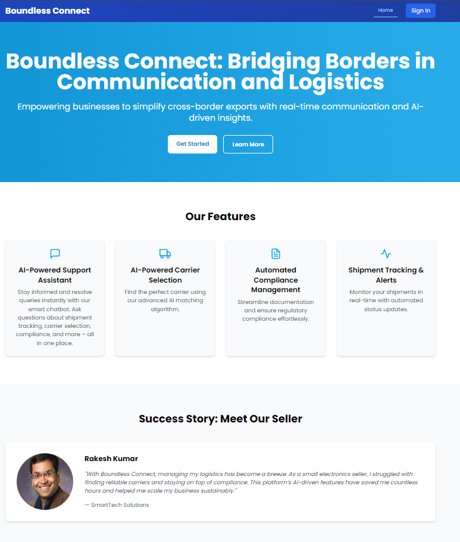
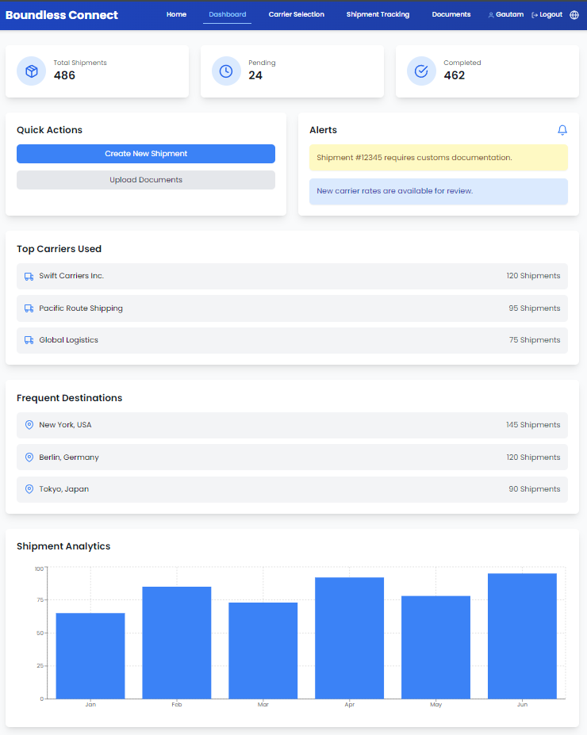
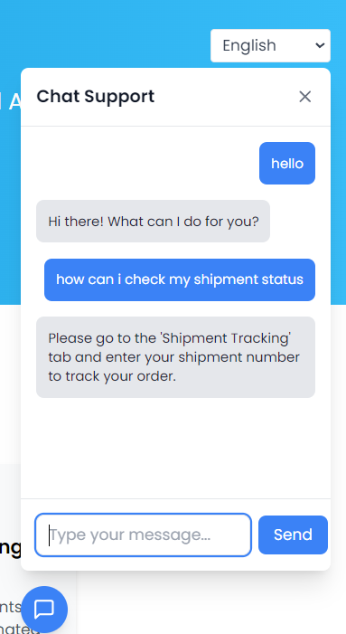

# **Boundless Connect: Simplifying Global SMB Exports (Prototype)**

### **Overview**
Boundless Connect is a prototype platform designed to simplify global trade for Indian SMBs. It integrates real-time communication, seamless document sharing, carrier selection, shipment tracking, and query resolution. This project is built as a prototype solution for SMBs like **FreshFruits Ltd.**.

---



---



---

### **Features (Prototype Scope)**

#### 1. **Login System**
- Authenticate users with pre-defined credentials.
- Access limited functionalities for demonstration purposes.

#### 2. **Dashboard**
- Provides a mock view of shipment stats and alerts.
- Quick actions to simulate key workflows like creating a shipment.

#### 3. **Carrier Selection (Prototype)**
- Demonstrates how carriers can be filtered based on cost, delivery time, and ratings.
- Provides eco-friendly packaging as a default option.

#### 4. **Chatbot**
- AI-powered chatbot that supports multiple languages including English, Hindi, Bengali, Telugu, Assamese, and Gujarati.
- Provides sample query resolution for shipment tracking and carrier-related questions.

---



---

### **Login Credentials**
Since this is a prototype, only a single seller account is available for demonstration purposes:

- **Email**: `gautam@example.com`
- **Password**: `password123`

---

### **Tech Stack**

#### **Frontend**
- **React.js**: For building interactive UI components.
- **Framer Motion**: For animations and transitions.
- **Tailwind CSS**: For responsive styling.
- **Axios**: For HTTP requests.

#### **Backend**
- **Node.js** with **Express**: For handling RESTful APIs.
- **Flask**: For chatbot integration.
- **MongoDB**: For mock data storage.

#### **Chatbot**
- **Flask**: Python-based microframework used to build the chatbot backend.
- **TensorFlow**: For training and running the chatbot's intent classification model.
- **Natural Language Toolkit (NLTK)**: For text preprocessing, including tokenization and lemmatization.
- **Keras**: For building and training the neural network model.
- **Pickle**: For serializing and loading the chatbot model's data such as classes and words.

---

### **Installation**

#### **Prerequisites**
1. **Node.js**: Ensure you have Node.js installed (v16+).
2. **Python**: Python 3.8+ is required for the Flask chatbot.

---

### **Backend Setup**
1. Clone the repository and navigate to the backend folder:
   ```bash
   git clone <repo-url>
   cd backend
   ```

2. **Install dependencies**:

   For Flask:
   ```bash
   python -m venv venv
   source venv/bin/activate  # Linux/Mac
   venv\Scripts\activate     # Windows
   pip install -r requirements.txt
   ```

   For Node.js:
   ```bash
   npm install
   ```

3. **Start the backend servers**:

   - Start Flask chatbot:
     ```bash
     python chatbot/app.py
     ```

   - Start Node.js API:
     ```bash
     npm run start
     ```

---

### **Frontend Setup**
1. Navigate to the frontend directory:
   ```bash
   cd frontend
   ```

2. **Install dependencies**:
   ```bash
   npm install
   ```

3. **Start the development server**:
   ```bash
   npm run dev
   ```

4. **Open the application in your browser at**:
   ```
   http://localhost:5173
   ```

---

### **Usage**
1. **Login**
   - Use the login credentials provided above to access the dashboard.

2. **Dashboard**
   - View pre-populated shipment statistics and alerts.
   - Use quick actions to simulate workflows such as creating a shipment.

3. **Carrier Selection**
   - Enter shipment details and filter carriers based on cost, delivery time, and ratings.
   - Choose between eco-friendly or normal packaging options.

4. **Chatbot**
   - Use the chatbot to ask questions about shipment tracking, carrier selection, and other topics.
   - Supports multiple languages including English, Hindi, Bengali, Telugu, Assamese, and Gujarati.

5. **Document Management**
   - Upload and view documents with a drag-and-drop interface.
   - Preview documents and check their validation status.

6. **Shipment Tracking**
   - Track shipments using a mock tracking ID.
   - View live tracking map and estimated delivery details.

---

### **Project Structure**
```
.
├── Backend
│   ├── chatbot/
│   ├── routes/
│   ├── models/
│   ├── server.js
│   └── .env
├── src/
│   ├── assets/
│   ├── components/
│   ├── pages/
│   ├── tailwind.config.js
│   ├── vite.config.js
│   ├── index.html
│   ├── App.css
│   ├── App.jsx
│   ├── index.css
│   ├── main.jsx
├── README.md
└── package.json
```

---

### **Notes**
- This project is a prototype and only includes limited functionality.
- Real-world features like order management APIs, dynamic pricing, and full data security measures are not yet implemented.

---

### **Future Improvements**
- **API Integration**: Add real-time order management using SP-API or shipping APIs.
- **Expanded Features**: Build a full-fledged document validation and tracking system. Add multi-seller accounts for role-based access.
- **Sustainability**: Integrate carbon offset programs for environmentally-conscious businesses.

---

### **Contributors**
- **Divyansh Sethi**: Frontend Development
- **Gautam**: Backend Development & Machine Learning
- **Manya Sehgal**: Machine Learning
